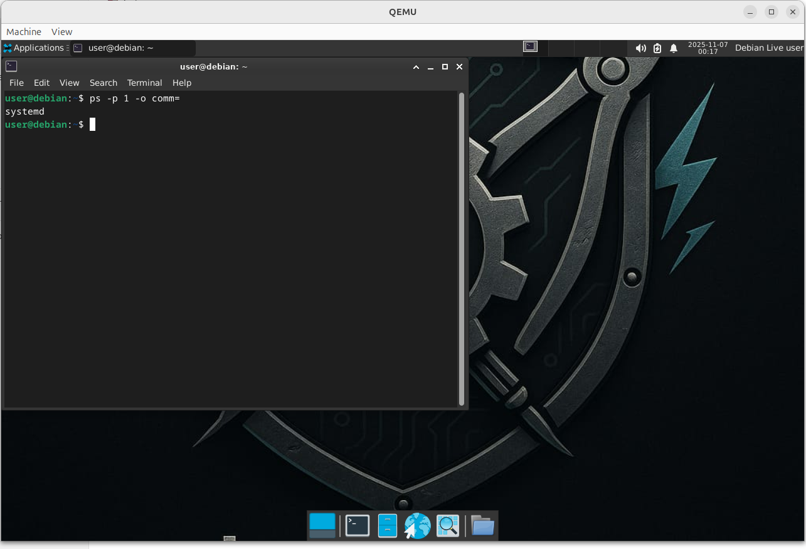

# makeAutomatic OS

**makeAutomatic OS** es una distribución GNU/Linux basada en **Debian 12 (Bookworm)**, creada por **Paulo Enrique Toro**.
Diseñada como un **entorno de desarrollo y laboratorio técnico**, combina estabilidad, personalización y soporte completo para *systemd* en modo Live y persistente.

---

## 🎯 Objetivo

Ofrecer una plataforma ligera y lista para usarse en:

* Laboratorios de electrónica, redes y automatización.
* Desarrollo de software en Python y Bash.
* Pruebas técnicas en entornos controlados sin afectar el sistema principal.
* Demostraciones de personalización Linux profesional.

---

## 🧩 Características principales

* Basada en **Debian 12 (Bookworm)** – arquitectura amd64.
* Entorno **XFCE** totalmente personalizado con tema y colores *makeAutomatic*.
* **Systemd** activo y funcional en el modo Live.
* **Firefox** preinstalado y operativo desde el arranque.
* Fondo de escritorio con el logo oficial `makeAuto-logo.jpeg`.
* Compatibilidad con LightDM y coherencia visual en todo el sistema.
* Construida íntegramente con `live-build`.

---

## 🛠️ Construcción desde código

Requisitos previos:

```bash
sudo apt install live-build debootstrap systemd-container
```

Clonar y construir:

```bash
git clone https://github.com/makeAutomatic/makeAutomaticOS.git
cd makeAutomaticOS
sudo lb clean --binary
sudo lb build
```

El resultado se genera como:

```
live-image-amd64.hybrid.iso
```

---

## 🖥️ Capturas




*(Las imágenes deben estar en `~/makeAutomaticOS/imagenes/` o en tu servidor web.)*

---

## ⚙️ Requisitos mínimos

* CPU: Intel i3 o superior
* RAM: 2 GB (recomendado 4 GB)
* Almacenamiento: 10 GB libres o USB ≥ 4 GB

---

## 🧑‍💻 Autor

**Paulo Enrique Toro**
Ingeniero electrónico – fundador de [makeAutomatic](https://makeautomatic.com)
Colombia, 2025

---

## 📜 Licencia

Distribuido bajo **GNU General Public License v3.0 (GPL-3.0)**
Consulta el archivo `LICENSE` para más detalles.


## 🔐 Credenciales predeterminadas (modo Live)

- **Usuario:** `user`  
- **Contraseña:** `live`

> Nota: la cuenta `root` existe pero se encuentra bloqueada por defecto (sin acceso directo).  
> Para tareas administrativas, use `sudo -i` desde el usuario `user`.


---

## 📦 Rutas técnicas principales

Estas son las rutas reales dentro del proyecto que definen la personalización del sistema:

```
config/includes.chroot/usr/share/backgrounds/makeAuto-logo.jpeg
→ Imagen de fondo por defecto de XFCE.

config/includes.chroot/etc/xdg/xfce4/xfconf/xfce-perchannel-xml/xfce4-desktop.xml
→ Configuración global del fondo y estilo de XFCE para todas las sesiones.

config/includes.chroot/etc/skel/.config/xfce4/xfconf/xfce-perchannel-xml/xfce4-desktop.xml
→ Configuración XFCE predeterminada copiada a nuevos usuarios (incluido el usuario live).

config/includes.chroot/etc/lightdm/lightdm-gtk-greeter.conf
→ Configuración visual del login (LightDM).

config/includes.chroot/etc/profile.d/makeauto.sh
→ Variables de entorno o scripts personalizados que se cargan al inicio de sesión.

config/includes.chroot/etc/xdg/autostart/makeauto.desktop
→ Archivo de autoinicio (ejecuta apps o scripts al arrancar XFCE).

config/includes.chroot/usr/share/doc/makeautomatic/LICENSE
→ Copia de la licencia dentro del sistema (opcional, si se incluye manualmente).
```

---

**makeAutomaticOS – tecnología hecha con propósito.**
